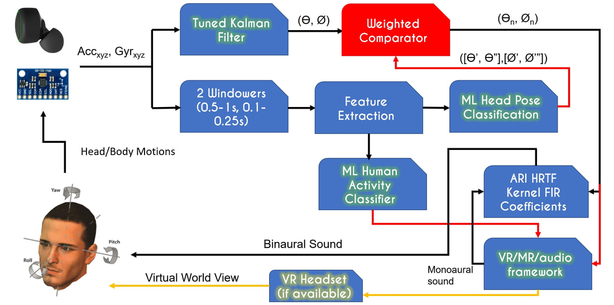

# MREarable: Integrating Spatial Audio in a Mixed Reality Environment through Earable Sensor Modalities  

Course project repository for ECE M202A (Fall 2019). Members: Swapnil Sayan Saha, Vivek Jain and Siyou Pei. Supervisor: Dr. Mani Srivastava, Professor of ECE and CS, UCLA

The goal of Project MREarable (Mixed Reality Earable) is to integrate dynamic/spatial audio capabilities in a mixed reality environment (e.g. CONIX Arena) using sensor modalities from the physical world, in particular, inputs from the eSense earable inertial measurement unit in an attempt to create a digital twin of sound dynamics. 

Project MREarable forms the basis for a novel perceptron-processing-feedback loop in a mixed reality context, where in we envision perception and feedback using the same device. We have showcased that it is not necessary to use convoluted, computationally expensive VR headsets for receiving feedback from virtual objects or sending perception to virtual world without sacrificing low latency. In addition, our earable head-tracker's performance exceed the state-of-the-art performances achieved in literature. Using Kalman Filter, we obtained a median delta motion errors of 8.3 and 5.6 degrees in azimuth and elevation planes respectively while our machine learning framework (XGBoost) achieves mean absolute error 17.7 and 7.5 degrees in azimuth and elevation planes respectively with classification accuracies of ~96.9% and ~91.9%. The errors are well within the binaural sound localization range of humans (empirically verified in our experiments). Furthermore, our supervised HAR classifiers achieved classification accuracy of 94.6% using CSVM and 94.25% using SNN_15, exceeding literature performance.

Project Website and Results: https://svsecem202a.weebly.com/

